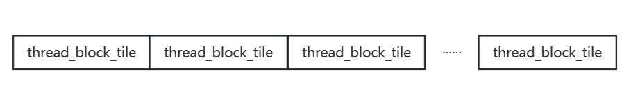

<<<<<<< HEAD
CUDA Stream Compaction
======================

**University of Pennsylvania, CIS 565: GPU Programming and Architecture, Project 2**

* PrimedErwin
  * (TODO) [LinkedIn](), [personal website](), [twitter](), etc.
* Tested on: (TODO) Windows 11, i9-13950HX @ 2.20GHz 64GB, RTX 3500 12282MB (ISN 257 Lab)

### (TODO: Your README)

Include analysis, etc. (Remember, this is public, so don't put
anything here that you don't want to share with the world.)

## Implement

---
### CPU scan & stream compaction
a simple loop

### GPU naive scan
This is implemented with the reference to [3-Parallel-Algorithms-1.pptx - Google 幻灯片](https://docs.google.com/presentation/d/1ETVONA7QDM-WqsEj4qVOGD6Kura5I6E9yqH-7krnwZ0/edit?pli=1#slide=id.p31), page 20.
Here are a few differences between reduction and scan. For reduction, simply calculate the sum per block, then add them up to get the final sum, you don't need to consider sync. But in scan (no matter inclusive or exclusive), the current step relies on the former one. So between every op, a sync is needed. For a single block, \_\_syncthreads() is enough. For the same reason, additional buffer is needed. 
Naive scan cannot compute array with size above 1024. This has been fixed in efficient scan, with implicit sync.
Tip: with RTX3500Ada, capability 8.9, hardware accelaration can be implemented with cg::exclusive_scan(), then recursive sort each group of results together. 

### GPU efficient scan and compaction
In this section, the thought of binary tree is implemented. Binary tree has 2 phases, up-sweep and down-sweep, after 2 phases, the array's value is replaced with prefix num. Then, with map and scatter operations, the compaction can be finished.
Among these operations, scan is the most important part. Considering a very long array, we need more blocks to handle it. Though we don't need an additional buffer due to the benefit of binary tree, a sync is still needed between two operations. So how to sync all the threads in different blocks is the problem. 

One of the solutions is cooperative groups. grid_group can sync all the threads in current grid by this_grid().sync() (or something else). But this need compilation option -rdc=true(I did this), compute capability above 6.0(I did this too), cudaLaunchCooperativeKernel. But my program always crashes at cudaLaunchCooperativeKernel. I don't know why, no dynamic parallelism in my kernel.

Another solution is implicit synchronization. Take a look at up-sweep and down-sweep algorithms, their for loop can be split up to simple kernels, then with a for loop, with each time a kernel runs with multiple blocks, all the threads will sync implicitly. 

### GPU thrust scan and compaction
It's mainly implemented by thrust::exclusive_scan and thrust::remove_if.

### Radix Sort
Radix sort doesn't compact stream. It uses exclusive scan to sort. It's useful to short bit arrays. Radix sort is used in one thread block in a SM, so the results are sorted chunks. Then use recurisve merge to combine two sorted chunks into one. 

### About hardware acceleration
I tried exclusive scan with cooperative_groups::exlusive_scan(). I thought it would be better. But sadly, it runs a little bit slower than thrust::exclusive_scan(), and not so convenient. 
This works like this:

<<<<<<< HEAD
Here are a lot of block tile in the block. In `hac.cu`, I used 512 as blockSize, 32 as block tile size. Each tile are full of numbers. Now, we use cooperative_groups::exclusive_scan()(Yes, cc above 8.0 has a hardware acceleration), so each tile is scaned with just one line code, just like thrust.

Then scan tiles to get a scanned block. Inspired by the binary tree, in binary tree each loop will shut down half of the threads. But what if we always use half of the threads?
It goes like this:

Arrow means the tile performs an add, the same color means their prefix sum are processed. About the processing, for example, d = 0, id 1 and id 0, id 1 will add the last element of id 0 to all the element id 1 has, the last prefix num is also added, so we will get an array of prefix sum from id 0 to id 1 tile. Later a block scan is performed with the same theory.
Each time half of the threads are running, and it only need once to complete the whole array, no up-sweep or down-sweep. This sounds amazing! But in implementation, I found this is not so good. **I have to decide which tile group should run this time!** These additional computation costs me a lot of time. So this is slower than efficient scan, a little slower than thrust scan. 

## Analysis

The analysis above DOES NOT include cudaMalloc, cudaMemcpy cudaFree or other memory management operations. The unit of time is ms.
GPU performs better start from size 524288. A massive array is better for GPU.
During the test, my `hac.cu` scan is a little slow than thrust::exclusive_scan. So I guess thrust lib also make better use of threads than effiecient_scan. And it's fast even with an array size of 16M, about 10 times faster than efficient scan.
 I remember that smem is about 400-800GB/s? while gmem is about 40-100GB/s, So about thrust, I think it make the most use of threads, and shared memory.
=======

Here are a lot of block tile in the block. In `hac.cu`, I used 512 as blockSize, 32 as block tile size. Each tile are full of numbers. Now, we use cooperative_groups::exclusive_scan()(Yes, cc above 8.0 has a hardware acceleration), so each tile is scaned with just one line code, just like thrust.

Then scan tiles to get a scanned block. Inspired by the binary tree, in binary tree each loop will shut down half of the threads. But what if we always use half of the threads?
It goes like this:

Arrow means the tile performs an add, the same color means their prefix sum are processed. About the processing, for example, d = 0, id 1 and id 0, id 1 will add the last element of id 0 to all the element id 1 has, the last prefix num is also added, so we will get an array of prefix sum from id 0 to id 1 tile. Later a block scan is performed with the same theory.
Each time half of the threads are running, and it only need once to complete the whole array, no up-sweep or down-sweep. This sounds amazing! But in implementation, I found this is not so good. **I have to decide which tile group should run this time!** These additional computation costs me a lot of time. So this is slower than efficient scan, a little slower than thrust scan. 
